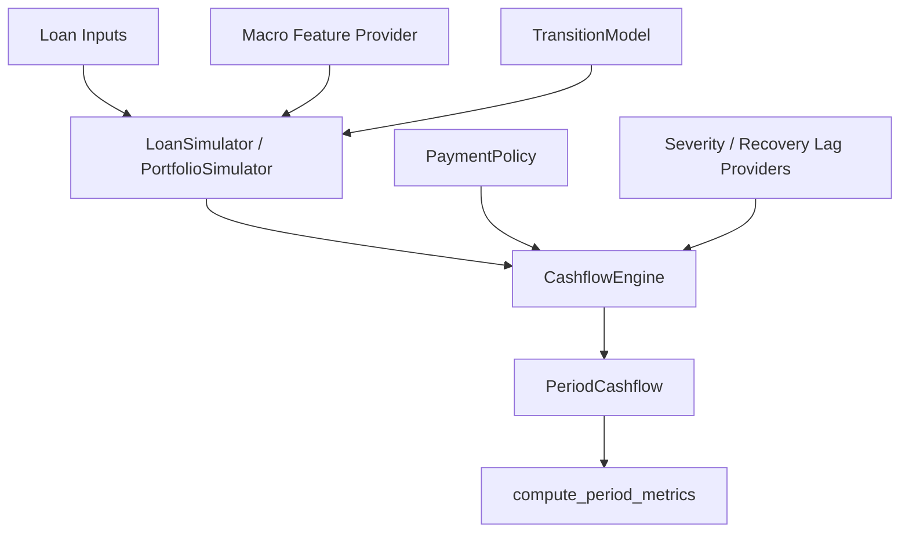

# Loan Simulation Framework Plan

## Current Goal

在 `quantbullet` 里做一套 lightweight Python loan simulation framework。第一阶段聚焦 monthly fixed-rate amortizing loans + seeded Monte Carlo paths。

参考 `roll-rate-model` 的核心思想：status transition、payment matrix、loan/portfolio cashflow aggregation。但这边不复制生产 C++ engine 的复杂度，优先保证语义清楚、代码易读、方便以后接 model。

## Current Status

Phase 1 主干已经完成：

- `Loan` / `LoanState` / `PeriodCashflow`
- configurable `StatusConfig`
- `TransitionModel` + `ConstantTransitionModel`
- `MatrixPaymentPolicy`
- severity / recovery lag providers
- single-period `CashflowEngine`
- date-based macro feature lookup
- seeded sequential `LoanSimulator` / `PortfolioSimulator`
- period-level metrics
- focused unit tests

当前测试命令：

```powershell
C:\GIT\quantbullet\.venv\Scripts\python.exe -m pytest tests/loan_simulation
```

## Architecture



## Module Map

- `status.py`: status vocabulary 和 accounting meaning。`valid_statuses` 是唯一合法状态全集，不做 alias，例如 `C` 不自动等于 `CURRENT`。
- `entities.py`: 核心 dataclasses。`LoanState.period=0` 是 as-of state；`PeriodCashflow.period=1` 是第一期 projected cashflow。
- `transition.py`: transition probability layer。`predict(...)` 只返回 next-status probabilities，不抽样、不算 cashflow。
- `payment.py`: scheduled payment collection rule。第一版用 `MatrixPaymentPolicy`，按 `begin_status -> end_status` 决定收几期 scheduled installment。
- `recovery.py`: severity 和 recovery lag provider。第一版有 constant provider，未来可以换 model provider。
- `cashflow.py`: one loan / one path / one period 的 accounting engine。处理 normal payment、prepay、default/loss、recovery event、delinquency reporting。
- `macro.py`: date-indexed macro lookup。`DataFrameMacroFeatureProvider` 用 calendar month match，而不是 projection period number。
- `simulator.py`: sequential Monte Carlo runner。负责 seed、path loop、macro lookup、transition sampling、pending recovery event、DataFrame outputs。
- `metrics.py`: 从 simulator cashflow output 计算 SMM/CPR、MDR/CDR、loss、net loss、recovery、delinquency metrics。

## Key Design Decisions

`StatusConfig` owns status meaning:

- `valid_statuses`: 全部合法状态
- `terminal_statuses`: 停止正常 scheduled activity
- `prepay_statuses`: full payoff / prepay event
- `default_statuses`: realized loss/recovery event
- `delinquency_buckets`: delinquency reporting bucket

`TransitionModel` 只负责概率：

```python
predict(
    loan,
    current_state,
    macro_features=None,
    path_features=None,
) -> Mapping[str, float]
```

`CashflowEngine` 只负责 accounting。它接收已经 sampled 的 `end_status`，然后分三类处理：

- prepay: collect current interest + full principal
- default: recognize loss now, schedule recovery event
- normal/delinquent/cure: ask `PaymentPolicy` how many scheduled payments to collect

`start_date` 是 simulation as-of date。内部 `period=0` 没有 cashflow；第一条 cashflow 是 `period=1`，日期是 `start_date + 1 month`。

Scheduled payment 是 simulation-start baseline：

- 如果 `Loan.scheduled_payment` provided，就用它
- 否则用 current simulation-start balance over remaining term 计算
- simulation 内不自动 recast；未来可以加 explicit recast/amortization policy

`Loan.original_balance` 是 reporting denominator，主要用于 CGL / cumulative loss rate。没传时默认等于 `Loan.balance`；seasoned pool 可以显式传 origination balance 或 deal reporting balance。

Recovery lag 不会被 horizon 截断。horizon 内产生的 pending `RecoveryEvent` 会继续输出到 recovery due period。

## Metrics

`compute_period_metrics(...)` consume simulator cashflow DataFrame。

当前输出：

- `smm`, `cpr`
- `mdr`, `cdr`
- `period_loss_rate`
- `period_net_loss`
- `cumulative_loss`
- `cumulative_net_loss`
- `cumulative_loss_rate`
- `cumulative_net_loss_rate`
- `delinquency_rate`

`compute_period_metrics(...)` requires `original_balance` for cumulative loss rate denominators. It does not silently fall back to begin balance for CGL-style metrics.

## Deferred

暂不做：

- external ML model loading
- GAM / softmax coefficient parsing
- multiprocessing / Ray
- Excel export
- full production-style `pmt_matrix` compatibility
- path feature tracker
- transition probability trace
- performance optimization

这些都可以在当前接口边界上继续加。

## Next Ideas

- 加一个 end-to-end example，展示从 loans + transition table + payment matrix 到 metrics 的完整 workflow。
- 加 `PathFeatureTracker`，维护 `ever_delinquent`、`months_since_last_dq`、burnout 等 path-dependent features。
- 给 metrics 加 explicit denominator，例如 `original_balance` / `orig_bal`。
- 加 transition probability trace，方便 debug 和 explainability。
