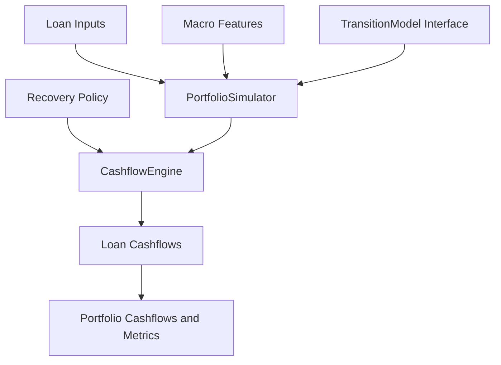

# Loan Simulation Framework Plan

## Background

This document tracks the plan for adding a lightweight, readable, and testable Python loan simulation framework to `quantbullet`.

The first phase will focus on monthly fixed-rate amortizing loans and Monte Carlo path simulation. The design references the state-transition and portfolio aggregation ideas in `roll-rate-model`, but intentionally avoids copying its production-oriented complexity.

## Confirmed Phase 1 Scope

- Add a new Python package at `src/quantbullet/loan_simulation`.
- Use monthly fixed-rate amortizing loan assumptions.
- Support Monte Carlo path simulation with reproducible seeds.
- Keep the cashflow engine independent from transition model implementations.
- Support loan-level path cashflows, loan-level averaged cashflows, and portfolio-level cashflows.
- Track scheduled interest/principal, ending balance, delinquency balances, prepayment, default, loss, and recovery.
- Support recovery lag and severity through simple provider interfaces.
- Pass macro features through to transition models without coupling the engine to specific feature names.

## Deferred From Phase 1

- External ML model loading.
- GAM or softmax coefficient parsing.
- Multiprocessing or Ray execution.
- Excel export.
- Full `pmt_matrix` compatibility.
- Production-style model registries.

These should remain possible future additions through the model and assumption interfaces.

## Architecture



## Proposed Files

- `src/quantbullet/loan_simulation/status.py`: default status constants, `StatusConfig`, and shared status normalization.
- `src/quantbullet/loan_simulation/entities.py`: `Loan`, `LoanState`, and period result dataclasses.
- `src/quantbullet/loan_simulation/transition.py`: `TransitionModel` abstract base class and `ConstantTransitionModel`.
- `src/quantbullet/loan_simulation/assumptions.py`: severity and recovery lag providers, starting with constants.
- `src/quantbullet/loan_simulation/cashflow.py`: per-period fixed-rate loan accounting.
- `src/quantbullet/loan_simulation/simulator.py`: seeded Monte Carlo loan and portfolio simulation.
- `src/quantbullet/loan_simulation/metrics.py`: portfolio and loan metric calculations.
- `src/quantbullet/loan_simulation/__init__.py`: public API exports.
- `tests/loan_simulation`: focused test coverage for the new package.

## Model Interface

The first version should keep the transition interface intentionally small:

```python
TransitionModel.predict(
    loan,
    current_state,
    macro_features,
    path_features,
) -> dict[str, float]
```

Projection period, loan age, balance, and current status are read from `current_state`. The transition model returns probabilities only; the simulator will handle random sampling from those probabilities. A later model-backed implementation can use the same interface, including macro features.

## Default Status Set

- `CURRENT`
- `DQ30`
- `DQ60`
- `DQ90`
- `DEFAULTED`
- `PAID_OFF`

`DEFAULTED` and `PAID_OFF` are terminal statuses for scheduled loan activity. Recovery cashflow may still be emitted after a configured recovery lag.

Status names should remain configurable through `StatusConfig`. The default status set is only a convenience for common fixed-rate amortizing loan use cases; custom use cases can define states such as `LIQ`, `SOLD`, `REFI`, or `CHARGED_OFF` without changing the engine.

`StatusConfig.valid_statuses` is the authoritative status vocabulary. Transition tables should use the same vocabulary and must cover every valid status. The framework does not infer aliases such as `C` -> `CURRENT`; users should pick one naming convention per simulation setup.

## Implementation Checklist

- [x] Define loan/status/result dataclasses and the public package API.
- [x] Implement the transition protocol and constant probability transition model.
- [ ] Implement fixed-rate amortization, prepayment, delinquency, default loss, and lagged recovery accounting.
- [ ] Implement seeded Monte Carlo loan and portfolio simulation outputs.
- [ ] Add focused tests for amortization, transitions, recovery lag, aggregation, and macro feature pass-through.

## Test Plan

Use the local virtual environment:

```powershell
C:\GIT\quantbullet\.venv\Scripts\python.exe -m pytest tests/loan_simulation
```

Initial test cases:

- Scheduled amortization math for a loan with no prepayment or default transitions.
- Constant transition validation and reproducible seeded sampling.
- Prepayment pays off the balance and stops future scheduled cashflows.
- Default records loss immediately and recovery after the configured lag.
- Portfolio aggregation equals the sum or average of loan-level outputs.
- Macro feature payload reaches the transition model.
